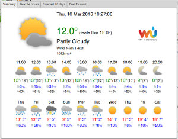

# Weather splash app

### Introduction
Lightweight PyQt Weather App based on Weather Underground API. **Requires API key!**

The main application window has no frame, like a splash screen. 
It closes on any key press other than left/right arrows, and on mouse clicks outside of the window.
Finally, it will close itself after 60s of no keybord activity.

The weather data is put in tabs which can be changed using arrows or mouse interactions. 
Each tab is a functional browser window, hence links can be clicked.

The fetched data is stored in `~/.weather/` and reused to prevent too many API calls.
   
### Requirements
* PyQt4 for Python
* API key for Weather Underground (developer key should work)

   - Put in `API.key` file in `~/.weather/` folder
   - OR run the script with `-k KEY` to update/create the key file

### QuickTabs framework
The frameless window is implemented as independent tabbed browser splash screen in `quicktabs.py`.
The `QuickTab` class extends `QTabWidget`, hence any number of tabs can be dynamically added and managed.

### Usage
Any query accepted by Weather Underground API should work. For example:
- `weather.py OR/Eugene`
- `weather.py 97403`

### Linux Mint Cinnamon integration
Can be integrated with [CommandRunner](https://cinnamon-spices.linuxmint.com/applets/view/226) to create a nice weather applet. 

The script provides short updates to CommandRunner to be showed on a panel. It also provides a click action so that clicking on the applet opens the application window.

Add the following as the command:

`weather.py -u QUERY`

and run it every 5 minutes.

# Credits
Icons designed by MerlinTheRed: http://merlinthered.deviantart.com/art/plain-weather-icons-157162192
